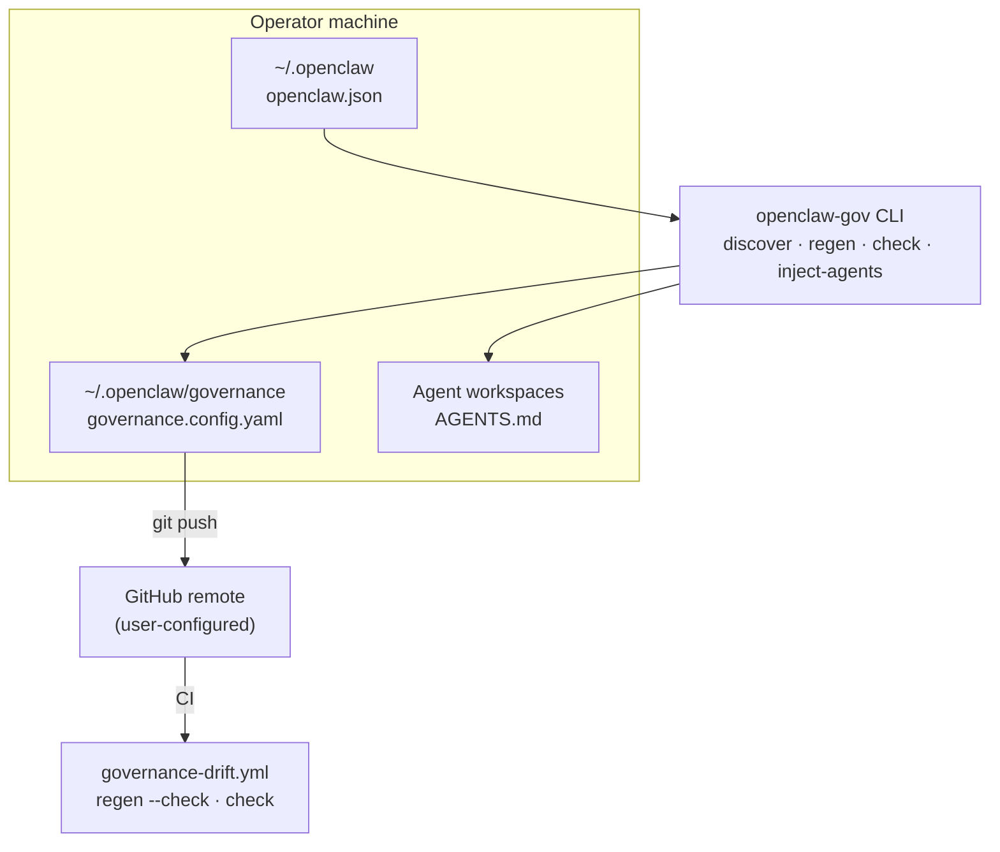

# openclaw-governance

Discovery, validation, and runbook generation for [OpenClaw](https://github.com/openclaw/openclaw) multi-agent installs.

`openclaw-gov` inventories agents, cron jobs, workspaces, and git repos on **your** machine, then materializes a local governance root (`registry.yaml`, runbook stubs, README sections, AGENTS.md stanzas). No dependency on any operator-specific workspace repo.

## System overview



## Install (v0.2 — git URL)

```bash
pip install "openclaw-governance @ git+https://github.com/pawlsclick/openclaw-governance@v0.2.0"
```

Editable dev install:

```bash
git clone https://github.com/pawlsclick/openclaw-governance.git
cd openclaw-governance
pip install -e ".[dev]"
```

## Quick start

```bash
# 1. Initialize governance root (default: ~/.openclaw/governance)
openclaw-gov init

# 2. Set your GitHub remote and which agents get governance stanzas (edit governance.config.yaml)

# 3. Discover live state (dry-run; writes inventory snapshot only)
openclaw-gov discover

# 4. Materialize registry + runbook stubs
openclaw-gov discover --write

# 5. Regenerate README tables and validate
openclaw-gov regen --write
openclaw-gov check
openclaw-gov doctor

# 6. Inject governance stanza into selected agent AGENTS.md files
openclaw-gov inject-agents --write

# 7. Remove stanzas from agents no longer in the inject set
openclaw-gov inject-agents --write --prune
```

Custom governance root (e.g. dedicated git repo):

```bash
openclaw-gov init --root ~/Projects/my-openclaw-governance
cd ~/Projects/my-openclaw-governance
openclaw-gov discover --write --root .
```

## Commands

| Command | Description |
|---------|-------------|
| `openclaw-gov doctor` | Check OpenClaw home, config, remote URL, git origin, inject list |
| `openclaw-gov init` | Scaffold governance root from templates |
| `openclaw-gov discover` | Inventory agents/crons/repos (dry-run) |
| `openclaw-gov discover --write` | Write `registry.yaml` + runbook stubs |
| `openclaw-gov check` | Validate registry ↔ runbooks ↔ README |
| `openclaw-gov regen --write` | Refresh README summary + RACI markers |
| `openclaw-gov inject-agents --write` | Add governance block to selected `AGENTS.md` files |
| `openclaw-gov inject-agents --write --prune` | Inject selected agents and remove stanza elsewhere |
| `openclaw-gov inject-agents --agent main --write` | Inject one agent (overrides config for this run) |

## Configuration

`governance.config.yaml` in the governance root:

- `openclaw_home` — usually `~/.openclaw`
- `governance_root` — this directory
- `remote.url` — GitHub (or other) remote where you push governance changes
- `remote.default_branch` — default branch name (default: `main`)
- `accountable_humans` — names allowed in RACI accountable fields
- `agents.broadcast_excluded` — cron-only agents omitted from broadcast RACI
- `agents.inject_included` — allowlist of agent ids that receive the governance stanza in `AGENTS.md`. **Omit the key** to inject all agents; **`[]`** injects none until you pass `--agent`
- `discovery.*` — script globs and git repo scan toggles

Example:

```yaml
remote:
  url: "https://github.com/you/your-governance-repo.git"
  default_branch: main

agents:
  inject_included:
    - main
    - research
```

## What discover creates

For each OpenClaw cron job:

- Registry entry: `status: discovered`, `runtime_status` from enabled flag
- Runbook stub: `workflows/runbooks/<agent>.cron.<name>.md` (skipped if file already exists)
- Inventory snapshot: `workflows/discovered-inventory.json`

Promote workflows to `active` / `required` after you verify triggers and fill in runbook details (see `workflows/README.md` in the governance root).

## CI

After `init`, commit the governance root and enable `.github/workflows/governance-drift.yml`. It installs this package from git and runs `openclaw-gov regen --check` and `openclaw-gov check`.

## License

MIT
