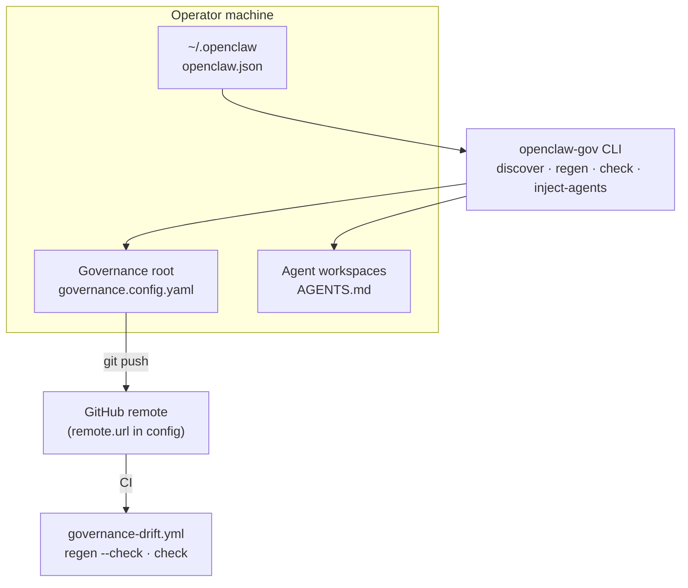

# OpenClaw governance (instance)

This directory is the **governance root** for one OpenClaw install. It is generated and maintained by [openclaw-governance](https://github.com/pawlsclick/openclaw-governance).

## System overview



## Quick commands

```bash
openclaw-gov doctor
openclaw-gov discover          # dry-run
openclaw-gov discover --write  # registry + runbook stubs
openclaw-gov regen --write
openclaw-gov check
openclaw-gov inject-agents --write
openclaw-gov inject-agents --write --prune
```

Configure `remote.url` and `agents.inject_included` in `governance.config.yaml` before injecting stanzas.

## Tracked workflow summary

<!-- governance:workflow-summary:begin -->
The current registry tracks 0 workflows:
<!-- governance:workflow-summary:end -->

## Agent RACI

<!-- governance:agent-raci:begin -->
### Agent catalog

| Agent ID | Name | Role | Workspace |
|---|---|---|---|
<!-- governance:agent-raci:end -->
